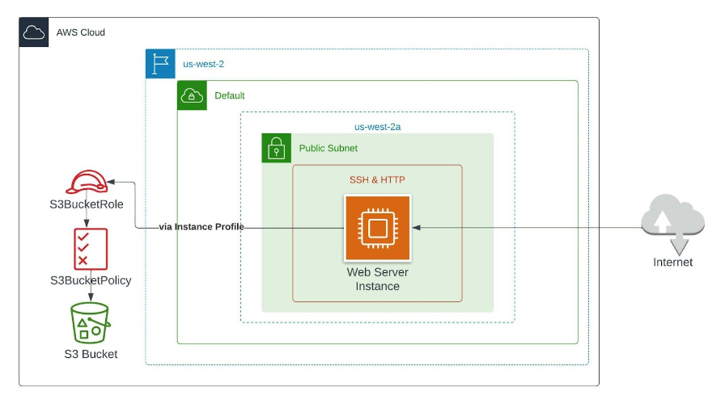

# IAM resources on CloudFormation

In this demo we create the following resources
- An IAM Policy Allowing all actions on a certain S3 bucket and the objects within it
- An IAM Role that can be assumed by the EC2 Service and has the permissions of the policy
- An IAM Instance Profile that allows 1-to-N Mapping between EC2 instances and IAM Roles
- A Security Group allowing for HTTP and SSH Access
- A web-server on an EC2 instance running Amazon Linux and Apache Web Service
